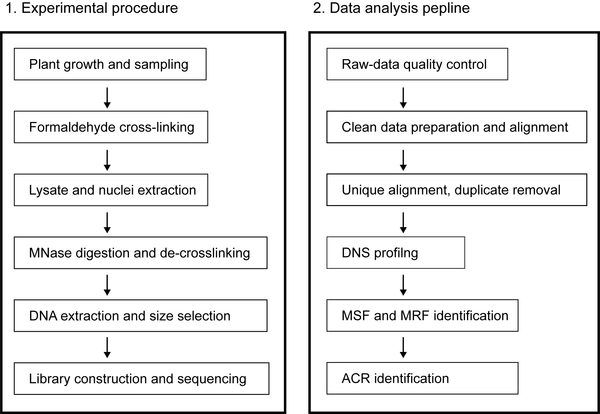
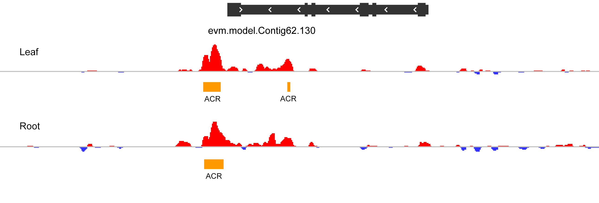

[](http://www.gnu.org/licenses/gpl-3.0)

# Identification of accessible chromatin regions with MNase-seq

This is an workflow to call accessible chromatin regions (ACRs) in plants using differential MNase digestion and high-throughput sequencing (MNase-seq, left in the flow chart) and data analysis (right in the flow chart).



## Installation

- __Running environment__: 
    - The workflow was constructed based on the __Linux system__ running the Oracle v1.6 to 1.8 java runtime environment (JREs).

- __Required software and versions__: 
    - [Deeptools v3.4.3](https://deeptools.readthedocs.io/en/latest/index.html) 
    - [Samtools v1.6](http://www.htslib.org/doc/samtools.html)
    - [BEDTools v2.29.1](https://bedtools.readthedocs.io/en/latest/content/bedtools-suite.html)
    - [R v 3.2.2](https://www.r-project.org/)
    - [IGV v 2.5.0](http://software.broadinstitute.org/software/igv/)
    - [Trimmomatic v 0.36](http://www.usadellab.org/cms/?page=trimmomatic)
    - [Bowtie2 v 2.3.4](http://bowtie-bio.sourceforge.net/bowtie2/index.shtml)
    - [FastQC v0.11.8](https://www.bioinformatics.babraham.ac.uk/projects/fastqc/)

## Input Data

The demo data used here is the paired-end fastq file generated by using Illumina platform.  
- R1 FASTQ file: `input/demo_leaf_light.r1.fq`
- R2 FASTQ file: `input/demo_leaf_light.r2.fq`

The fastq file includes data under light-digestion and heavy-gigestion.
- Light-digestion FASTQ file:`input/demo_leaf_light.r1.fq`
- Heavy-digestion FASTQ file:`input/demo_leaf_heavy.r1.fq`

The data generated in two tissue types are provided.
- Leaf tissue FASTQ file: `input/demo_leaf_light.r1.fq`
- Root tissue FASTQ file: `input/demo_root_light.r1.fq`

## Major steps

#### Step 1: Upload your data
- Create a new working directory to store all the MNase-seq-related data and files.

```
cd data1/user/path  # enter your working directory
mkdir MNase_seq
cd MNase_seq
mkdir raw_datathis directorydata  # all your sequencing data here
```

#### Step 2: Quality control
- Use FastQC to evaluate the quality of your raw data.

```
mkdir ./fastqc_result
for i in ./raw_data/*.fq.gz
do
fastqc -o ./fastqc_result $i
done
```

#### Step 3: Reads filtering: 
- Use Trimmomatic software to obtain clean data. The main goal of this step is to remove the adapter sequence, leading and trailing low-quality or N bases and sequences too short in length.
```
name=leaf_light
mkdir clean_data
java -jar trimmomatic-0.36.jar PE -phred33 \
  ./raw_data/*.r1.fq.gz \
  ./raw_data/*.r2.fq.gz \
  ./clean_data/$name.1P.fq \
  ./clean_data/$name.1U.fq \
  ./clean_data/$name.2P.fq \
  ./clean_data/$name.2U.fq \
  ILLUMINACLIP:data1/user/tools/Trimmomatic-0.36/adapters/\
  TruSeq3-PE-2.fa:2:30:10:1:true \
  LEADING:5 TRAILING:5 MINLEN:20 >trimmomatic.$name.log

```

#### Step 4: Quality control
- Use FastQC again to evaluate the quality of the clean data.
```
for i in ./clean_data/*.fq.gz
do
fastqc -o ./fastqc_result $i
done
```

#### Step 5: Sequence alignment
- Align the filtered clean data to the reference genome using Bowtie2 software. Before that, library the genome with bowtie2-build.
```
bowtie2-build ref_genome.fa ref.genome
samtools faidx ref_genome.fa
bowtie2 --phred33 -p 10 --reorder -5 6 \
  --no-mixed --no-discordant --no-unal --dovetail \
  -x /index_path/ref.genome \
  -1 ./$name.1P.fq \
  -2 ./$name.2P.fq \
  -S ./$name.sam >bowtie2.$name.log
```

#### Step 6: Non-unique and duplicate alignments removal
- Screen the alignment according to the MAPQ value in the alignment results. After that, remove the repeated reads due to PCR library amplification with samtools markdup.
```
function samtools_scripts(){
 samtools view -q 20 -bhS $name.sam -o $name.Q20.bam
 samtools sort -n $name.Q20.bam -o $name.Q20.nsort.bam
 samtools fixmate -m $name.Q20.nsort.bam $name.Q20.nsort.ms.bam
 samtools sort $name.Q20.nsort.ms.bam -o $name.Q20.ms.psort.bam
 samtools markdup -r $name.Q20.ms.psort.bam $name.Q20.psort.markdup.bam
 samtools index -c $name.Q20.psort.markdup.bam
}
samtools_scripts $name >samtools.$name.log
```

#### Step 7: Differential nuclease sensitivity (DNS) identification
- Subtract the mapped reads of heavy-digestion from light-digestion using bamCompare in the deepTools, and then normalize by the CPM method to output a DNS score file in bedgraph format.
```
bamCompare -b1 leaf_light.bam -b2 leaf_heavy.bam \
  --scaleFactorsMethod None --normalizeUsing CPM --operation subtract \
  --binSize 10 --smoothLength 50 --outFileFormat bedgraph \
  -o leaf_diff.bdg
```

#### Step 8: Bayes factor calculation
- Calculate the reads coverage from both light-digested and heavy-digested samples, and the CPM method is used for normalization. The Bayes factor is calculated for reads coverage in 10-bp intervals.
```
bamCoverage -b leaf_light.bam \
  --binSize 10 --smoothLength 50 \
  --normalizeUsing CPM --outFileFormat bedgraph \
  -o leaf_light.bdg
bamCoverage -b leaf_heavy.bam \
  --binSize 10 --smoothLength 50 \
  --normalizeUsing CPM --outFileFormat bedgraph \
  -o leaf_heavy.bdg
bedtools unionbedg \
  -i leaf_light.bdg leaf_heavy.bdg \
  -header -names light heavy \
>leaf.unionbdg
Rscript bayes_factor_caculator.R leaf.unionbdg
```

#### Step 9: ACRs identification
- DNS parts with values greater/less than 0 and Bayes values greater than 0.5 are defined as significant MSFs/MRFs. We referred to the significant MSFs as MNase-hypersensitive (MNase HS) regions or ACRs.
```
bedtools unionbedg \
  -i leaf_diff.bdg leaf_unionbdg.bayes \
  >leaf_diff.bayes
cat leaf_diff.bayes | awk '$4>0 && $5>0.5' | \
  cut -f1-3 | bedtools merge -d 200 \
  >leaf_MSF_bayes_0.5_merge_200.bed
cat leaf_diff.bayes | awk '$4<0 && $5>0.5' | \
  cut -f1-3 | bedtools merge -d 200 \
  >leaf_MRF_bayes_0.5_merge_200.bed
```

#### Step 10: Signal visualization
- Generate reads coverage depth in bigwig files with deepTools and then load them into the Integrative Genomics Viewer (IGV browser) for browsing.
```
bamCoverage -b leaf_light.bam \
--binSize 10 --smoothLength 50 \
  --normalizeUsing CPM --outFileFormat bigwig \
  -o leaf_light.bw
bamCoverage -b leaf_heavy.bam \
--binSize 10 --smoothLength 50 \
  --normalizeUsing CPM --outFileFormat bigwig \
  -o leaf_heavy.bw
bamCompare -b1 leaf_light.bam -b2 leaf_heavy.bam \
  --scaleFactorsMethod None --normalizeUsing CPM --operation subtract \
  --binSize 10 --smoothLength 50 --outFileFormat bigwig \
  -o leaf_diff.bw
```

## Expected results
This is an example result generated from the demo data. The upper track illustrates an gene model, the middle and lower tracks show the signal of MSFs (in red) and MRFs (in blue) in leaf and root, and significant MSF region, or ACRs, are detected and shown in orange segments. <br>





## License
It is a free and open source software, licensed under []() (choose a license from the suggested list:  [GPLv3](https://github.com/github/choosealicense.com/blob/gh-pages/_licenses/gpl-3.0.txt), [MIT](https://github.com/github/choosealicense.com/blob/gh-pages/LICENSE.md), or [CC BY 4.0](https://github.com/github/choosealicense.com/blob/gh-pages/_licenses/cc-by-4.0.txt)).